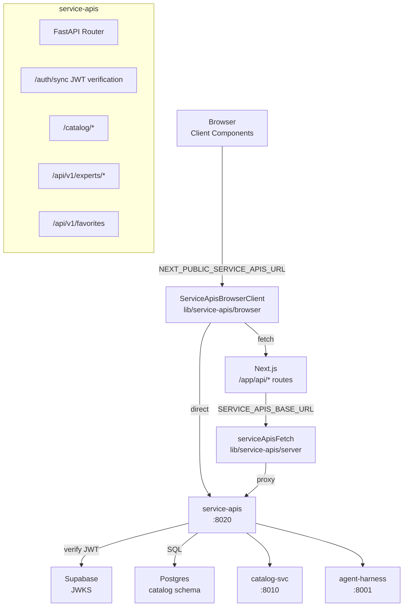
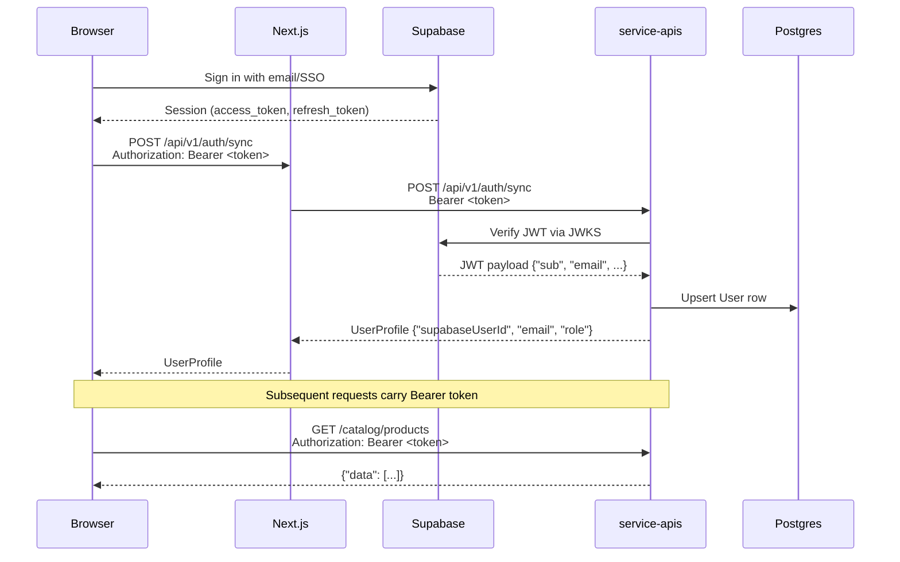
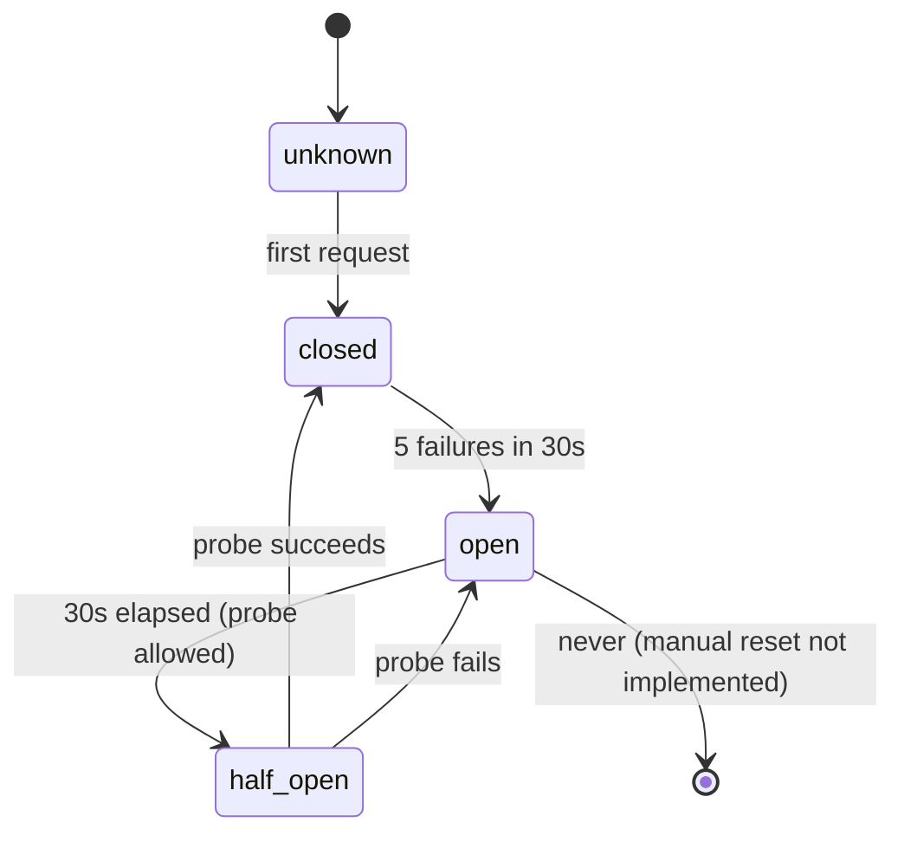
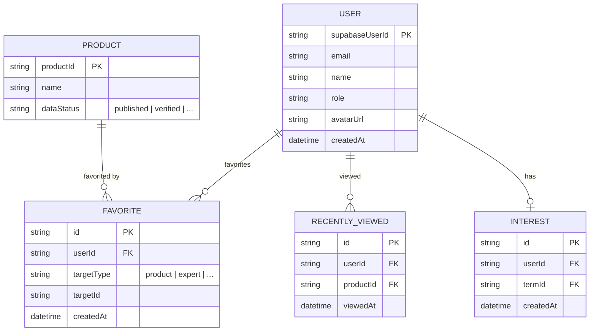

# Frontend — Service APIs Architecture

## Overview

The frontend is a Next.js App Router application (React/TypeScript) backed by two APIs:

- **Supabase** — authentication (`NEXT_PUBLIC_SUPABASE_URL`, `NEXT_PUBLIC_SUPABASE_ANON_KEY`)
- **service-apis** — FastAPI gateway on port 8020 — fronts catalog and agent services

Frontend code lives in `/app`, components in `/components`, shared logic in `/lib`.

---

## Service APIs Client Split

The frontend has two service-apis clients with separate entrypoints:

| Entry point | Environment | Used by |
|---|---|---|
| `@/lib/service-apis/browser` | Browser-exposed (`NEXT_PUBLIC_SERVICE_APIS_URL`) | Client Components, browser-only code |
| `@/lib/service-apis/server` | Server-only (`SERVICE_APIS_BASE_URL`) | Server Components, API routes |

**Rule: Never import `lib/service-apis/server` in Client Components or browser code.**

### Browser client

```typescript
import { ServiceApisBrowserClient } from '@/lib/service-apis/browser'

const client = new ServiceApisBrowserClient()

// Public — no auth
await client.get('/catalog/products')

// Auth-required — token resolved from browser Supabase session
await client.post('/api/v1/favorites', body, { requireAuth: true })

// SSR hydration — pass server-resolved token as override
await client.get('/api/v1/users/me/interests', { accessToken: propToken })
```

### Server client (SSR proxy)

```typescript
import { serviceApisFetch } from '@/lib/service-apis/server'
// or
import { serviceApisFetch } from '@/lib/service-apis/client'  // same thing, different path
```

The existing `lib/service-apis/client.ts` (server-only) is preserved for backward compatibility with legacy code that imports it directly. The `server.ts` entrypoint re-exports it for explicit server-only usage.

---

## Architecture



### Client Components vs Server Components

- **Client Components** — use `ServiceApisBrowserClient` via `lib/service-apis/browser`. Token comes from browser Supabase session. Direct calls to service-apis.
- **Server Components** — use `serviceApisFetch` via `lib/service-apis/server`. Token comes from server Supabase client (cookie-based session).
- **API Routes** (`/app/api/*`) — compatibility shims that proxy to `serviceApisFetch`. They are transitional and will be removed as each route's consumers migrate to the browser client.

---

## Authentication Flow



1. User signs in via Supabase — browser gets access token
2. On session start, browser calls `POST /api/v1/auth/sync` with Bearer token
3. service-apis verifies the JWT against Supabase JWKS endpoint
4. service-apis upserts the user in Postgres if first login, returns profile
5. All subsequent service-apis calls include `Authorization: Bearer <token>`

---

## Service APIs Routes

### Unversioned — Catalog

All catalog routes are unversioned (no `/api/v1` prefix):

| Method | Path |
|---|---|
| GET | `/catalog/products` |
| GET | `/catalog/products/{product_id}` |
| GET | `/catalog/products/{product_id}/pricing-plans` |
| GET | `/catalog/products/{product_id}/ratings` |
| GET | `/catalog/products/{product_id}/alternatives` |
| POST | `/catalog/search` |
| POST | `/catalog/compare` |
| GET | `/catalog/categories` |

### Versioned — `/api/v1/*`

All other service-apis routes live under `/api/v1`:

| Method | Path |
|---|---|
| POST | `/api/v1/auth/sync` |
| GET | `/api/v1/users/me` |
| PATCH | `/api/v1/users/me` |
| GET | `/api/v1/users/me/interests` |
| POST | `/api/v1/users/me/interests` |
| DELETE | `/api/v1/users/me/interests/{interestId}` |
| GET | `/api/v1/favorites` |
| POST | `/api/v1/favorites` |
| DELETE | `/api/v1/favorites/{favoriteId}` |
| GET | `/api/v1/recently-viewed` |
| POST | `/api/v1/recently-viewed` |
| DELETE | `/api/v1/recently-viewed/{id}` |
| GET | `/api/v1/experts/me/application` |
| POST | `/api/v1/experts/me/application` |
| PATCH | `/api/v1/experts/me/profile` |
| GET | `/api/v1/experts/me/profile` |
| GET | `/api/v1/experts/approved` |
| GET | `/api/v1/experts/recommended` |
| GET | `/api/v1/experts/{expertId}` |
| PATCH | `/api/v1/admin/experts/{id}` |
| GET | `/api/v1/admin/experts` |
| POST | `/api/v1/agent/query` |
| GET | `/api/v1/status` |

---

## Normalized Error Contract

All service-apis responses are normalized to one of two shapes.

**Success:**
```typescript
{ ok: true, data: T }
```

**Error:**
```typescript
{
  ok: false,
  status: number,       // HTTP status code
  error: {
    code: string,       // machine-readable error code
    message: string,    // human-safe message
    retryAfter?: number // seconds — for CIRCUIT_OPEN and RATE_LIMITED
  }
}
```

### Error codes

| Code | Status | When |
|---|---|---|
| `AUTHENTICATION_ERROR` | 401 | Missing or invalid JWT, expired token |
| `AUTHORIZATION_ERROR` | 403 | Insufficient permissions |
| `VALIDATION_ERROR` | 422 | Invalid request parameters |
| `RATE_LIMITED` | 429 | Too many requests; includes `retryAfter` |
| `CIRCUIT_OPEN` | 503 | Service downstream is down; includes `retryAfter` |
| `NOT_FOUND` | 404 | Resource does not exist |
| `CONFLICT` | 409 | Resource already exists (e.g., duplicate application) |
| `NETWORK_ERROR` | 0 | Browser could not reach service-apis (CORS, DNS, offline) |
| `NOT_CONFIGURED` | 503 | `NEXT_PUBLIC_SERVICE_APIS_URL` not set in environment |
| `INTERNAL_ERROR` | 500 | Unhandled server error — details never exposed to client |

### CIRCUIT_OPEN (503)

When a downstream service (catalog, experts, auth) has too many failures, the circuit breaker trips and returns 503 with `CIRCUIT_OPEN`. The `retryAfter` field (default 30s) tells the UI when to retry.

```typescript
if (result.ok === false && result.error.code === 'CIRCUIT_OPEN') {
  showToast(`Service temporarily unavailable. Retrying in ${result.error.retryAfter}s`)
  setTimeout(() => refetch(), result.error.retryAfter * 1000)
}
```

---

## Circuit Breaker and Readiness

### Endpoints

| Path | Purpose |
|---|---|
| `/health` | Process liveness — always 200 if uvicorn is running |
| `/readiness` | DB connectivity — checks Postgres connection |
| `/api/v1/status` | Public circuit state for all groups |

### Circuit Groups

Four independent circuit groups, each with its own failure threshold:

| Group | Protects |
|---|---|
| `catalog` | Product listing, search, detail, pricing |
| `experts` | Expert profiles, applications |
| `engagement` | Favorites, recently-viewed |
| `auth` | JWT verification, JWKS fetching |

### Circuit States



### State transitions

- **unknown** — initial state on process start
- **closed** — normal operation, requests pass through
- **open** — after 5 failures in a 30s window, requests are rejected with 503 `CIRCUIT_OPEN` for 30s
- **half_open** — after the 30s retry window, one probe request is allowed; success closes the circuit, failure re-opens it

### `/api/v1/status` response

```json
{
  "ok": true,
  "version": "...",
  "groups": {
    "catalog": { "status": "closed", "failureCount": 0, "lastFailureAt": null, "lastSuccessAt": 1234567890, "retryAfter": null },
    "experts": { "status": "open", "failureCount": 5, "lastFailureAt": 1234567890, "lastSuccessAt": null, "retryAfter": 1234567920 },
    "engagement": { "status": "closed", "failureCount": 0, ... },
    "auth": { "status": "closed", "failureCount": 0, ... }
  }
}
```

---

## Migration — Vertical Slices

The frontend is migrating from SSR proxy routes (`/app/api/*`) to direct browser calls via `ServiceApisBrowserClient`. This is done slice by slice to preserve working functionality.

### Slice 0 — Complete ✅

Browser client foundation:
- `lib/service-apis/error-utils.ts` — error normalization
- `lib/service-apis/browser-client.ts` — `ServiceApisBrowserClient` class
- `lib/service-apis/browser.ts` — browser-safe entrypoint
- `lib/service-apis/server.ts` — server-only entrypoint
- `env.example` — `NEXT_PUBLIC_SERVICE_APIS_URL` documented

### Slice 1 — Engagement (next)

- `useFavorites` hook — maps `{ productId }` ↔ `{ targetType, targetId }`
- `useRecentlyViewed` hook
- Deprecate `/app/api/favorites/*` and `/app/api/recently-viewed/*` (do not remove until UI migrated)

### Slice 2 — Catalog

- `useCatalogProducts` hook for product listing
- `useCatalogSearch` hook for hybrid search
- Deprecate `/app/api/products/*`, `/app/api/search/*`, `/app/api/categories/*`

### Slice 3 — Experts

- `useExperts` hook
- `useExpertApplication` hook
- Deprecate `/app/api/experts/*` routes

### Slice 4 — Admin / Agent

Admin and agent routes may remain SSR-only:
- They require server-side auth validation
- They are not high-traffic consumer paths
- Decision deferred until other slices complete

**Rule: Do not remove `/app/api/*` routes until the consuming UI component has been migrated to the browser client for that slice.**

---

## Environment Variables

### Browser-accessible (public, `NEXT_PUBLIC_*`)

These are embedded in the browser bundle and visible to client code:

```bash
NEXT_PUBLIC_SUPABASE_URL=https://your-project.supabase.co
NEXT_PUBLIC_SUPABASE_ANON_KEY=your_anon_key
NEXT_PUBLIC_SERVICE_APIS_URL=http://localhost:8020   # dev
NEXT_PUBLIC_SERVICE_APIS_URL=https://api.proploy.io   # prod
```

### Server-only

These are never embedded in the browser bundle:

```bash
# Used by lib/service-apis/server.ts (SSR proxy fallback)
SERVICE_APIS_BASE_URL=http://127.0.0.1:8020
```

---

## Local Development

### Prerequisites

service-apis must be running separately on port 8020:

```bash
cd ../service-apis
cp .env .env  # already configured
uv run uvicorn proploy_service_apis.api.server:app --reload --port 8020
```

### Commands

```bash
npm run dev          # Start Next.js dev server (port 3000)
npm run lint         # ESLint check
npm run build        # Production build (requires service-apis on :8020)
npm run generate-types  # Regenerate TypeScript types from schema
```

### Development notes

- service-apis runs on `http://localhost:8020`
- Frontend on `http://localhost:3000`
- `NEXT_PUBLIC_SERVICE_APIS_URL=http://localhost:8020` is set in `.env` for local dev
- Auth flow requires Supabase project configured with JWKS endpoint
- Circuit breaker state is per-process; each uvicorn worker has independent state

---

## Service APIs — Entity Contract



### Engagement contract — Frontend vs service-apis

Frontend UI uses `productId`. service-apis uses `{ targetType, targetId }`. The mapping happens in the hook layer, not in the browser client.

```typescript
// Frontend UI → service-apis (add favorite)
const body = { targetType: 'product', targetId: productId }
await client.post('/api/v1/favorites', body, { requireAuth: true })

// service-apis → Frontend UI (favorite response)
const { id, targetType, targetId, createdAt } = result.data
// Hook maps back to productId for UI consumption
```

---

## Agent Working Rules

When working in this codebase:

1. **Read this README first** before making changes to service-apis integration or routing
2. **Preserve browser/server client separation** — never import `lib/service-apis/server` in Client Components
3. **Preserve unversioned catalog routes** — catalog routes are `/catalog/*` not `/api/v1/catalog/*`
4. **Do not log JWTs or access tokens** — only log `alg`/`kid` from JWT header
5. **Do not introduce mock production paths** — no fake `if (env === 'production')` fallbacks that bypass service-apis
6. **Migrate one vertical slice at a time** — don't refactor multiple `/app/api/*` routes in one PR
7. **Do not claim Redis cache is implemented** — caching strategy is not yet designed
8. **Do not remove `/app/api/*` routes** until the consuming UI component is migrated to the browser client
9. **Respect the circuit breaker** — don't add retry logic that bypasses circuit open errors without user-visible feedback
10. **Preserve the auth handshake priority** — auth circuit must be verified before any cache or downstream circuit work proceeds

---

## Current Slice 0 Status

Files created by Slice 0:

```
lib/service-apis/
  error-utils.ts      — normalizeServiceApiError, isCircuitOpen, normalizeCircuitOpen
  browser-client.ts   — ServiceApisBrowserClient class (get, post, patch, put, delete)
  browser.ts          — browser-safe entrypoint (for Client Components)
  server.ts           — server-only entrypoint (for Server Components)
```

env.example updated with `NEXT_PUBLIC_SERVICE_APIS_URL`.

**Build note:** Full production build (`npm run build`) currently has unrelated errors in legacy routes (`app/api/user-profile/route.ts`, `app/api/avatar-url/route.ts`) that predate Slice 0. Slice 0 files are lint-clean and type-clean individually.