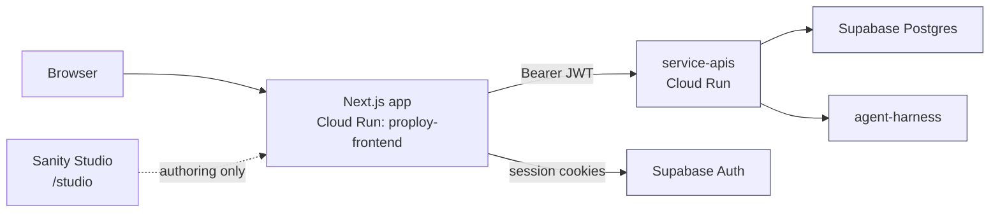
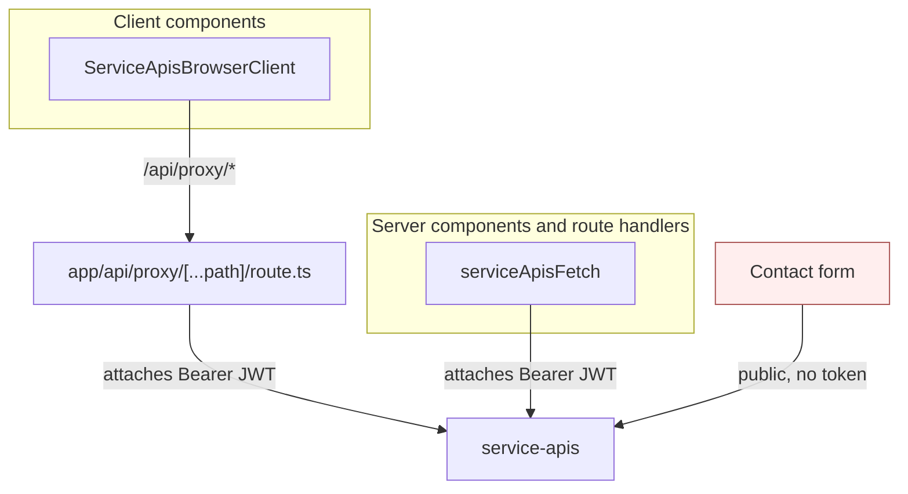
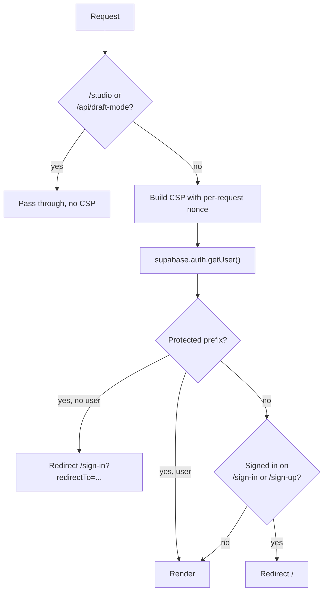
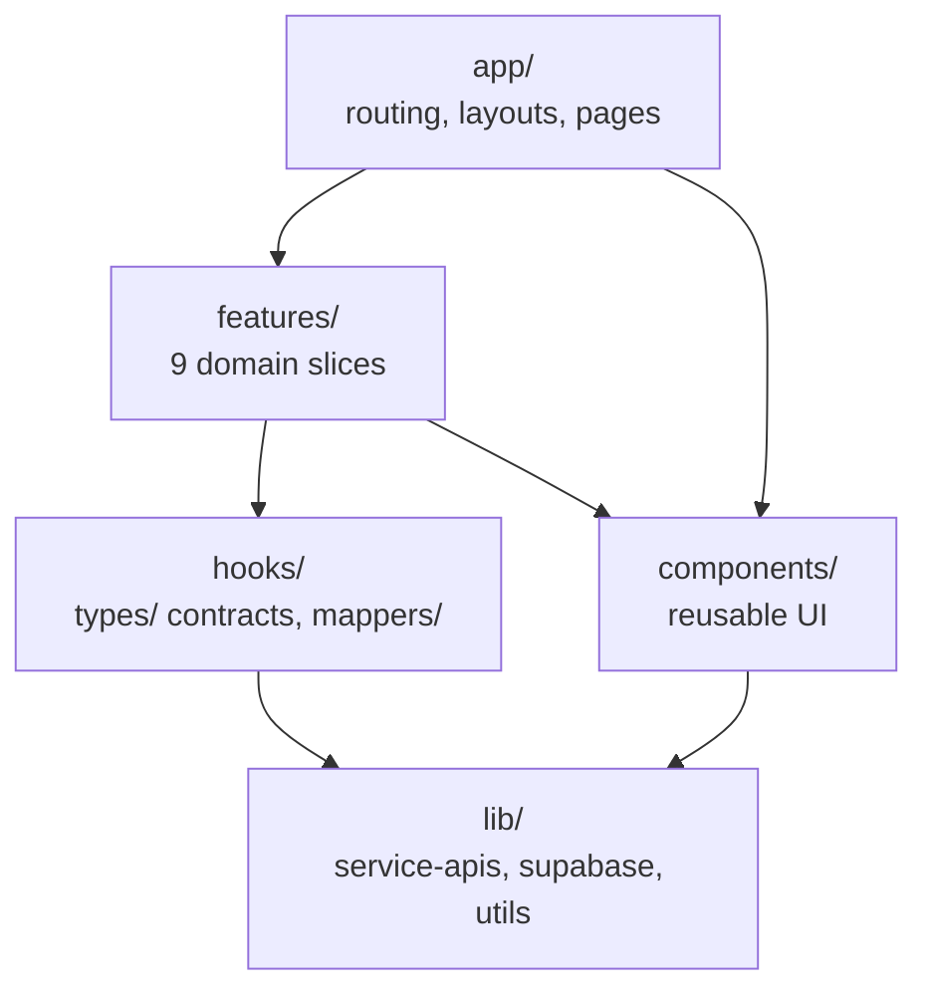
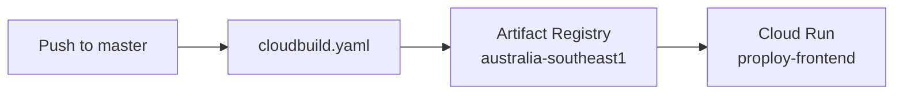

# Proploy frontend

The public-facing Proploy web app. Next.js App Router, organized by feature
slice, deployed to Cloud Run.

Stack: Next.js 16.2.11 (Turbopack), React 19, TypeScript 5, Tailwind CSS 4,
Supabase, Vitest. There is no React Query, SWR, Zustand, Axios, or React Router.

## System context

This app talks to two systems. It reads and writes application data through
`service-apis`, and it handles sessions directly with Supabase Auth. It never
reaches the database itself.



Sanity is mounted for content authoring at `/studio` and its schemas live in
`sanity/`. No site page renders Sanity content today, so it is an authoring
surface rather than a data source.

## How a request reaches the backend

There are three paths, and picking the wrong one is the most common source of
confusion here.



The browser never calls `service-apis` directly and never holds a token for it.
`ServiceApisBrowserClient` rewrites every request to `/api/proxy/<path>`, a
route in this app that attaches the token server-side.

Import `@/lib/service-apis/browser` in client components and
`@/lib/service-apis/server` in server components and route handlers. The server
client reads server-only environment variables, so importing it into browser
code breaks the build.

The proxy strips `x-require-auth`, `host`, and `x-agent-key` from the incoming
request, blocks `/internal/` outright, then decides whether to attach a token
from `AUTH_REQUIRED_PREFIXES`, a server-side path allowlist. A browser cannot
influence that decision.

**When you add an authenticated backend route, add its prefix to
`AUTH_REQUIRED_PREFIXES` in the same change.** Skip it and the proxy forwards
with no token, producing a 401 with no obvious cause. Nothing keeps that list in
step with `service-apis`.

`lib/service-apis/client.ts` forwards only `content-type`, `accept`,
`accept-language`, `accept-encoding`, `cache-control`, and `range` upstream. A
header added anywhere else never arrives at the backend.

The contact form is the one deliberate exception. `ContactForm.tsx` and
`ClosingCTA.tsx` post straight to `${NEXT_PUBLIC_SERVICE_APIS_URL}/api/v1/contact`,
which is public and needs no token. A new authenticated call written that way
has no token and fails.

## Route gating

`proxy.ts` at the repository root is the Next 16 middleware. It runs before every
matched request and does two jobs.



Protected prefixes: `/workspace`, `/dashboard`, `/AI_workspace`, `/onboarding`,
`/profile`, `/favorites`, `/become-expert`, `/expert-dashboard`, and most of
`/experts/`.

Studio bypasses the strict nonce policy because it relies on inline scripts the
nonce pipeline does not reach.

A browser call to an origin missing from `connect-src` in `proxy.ts` is blocked
by the Content Security Policy with no server-side trace. Add the origin there
when you add a new external call.

## Code layout



There is no `src/` directory.

`features/` holds domain meaning: what a contract is, how an engagement moves
between states. `hooks/` holds the generic boundary: the typed contract
mirroring the backend model, and the mapper to a view model. Infrastructure
belongs in `lib/`, never in `features/`.

`app/api/` holds only `auth/` route handlers and the backend proxy. There is no
general API layer in this app, and no health route, which is why the Cloud Run
deploy has no startup probe.

Regenerate the slice list with `ls -1 features` (9 at this commit).

## Local development

```bash
npm install
cp env.example .env   # note: env.example, no leading dot
npm run dev           # http://localhost:3000
```

Set `NEXT_PUBLIC_SUPABASE_URL`, `NEXT_PUBLIC_SUPABASE_ANON_KEY`,
`NEXT_PUBLIC_APP_URL`, `NEXT_PUBLIC_SERVICE_APIS_URL`, and the two
`NEXT_PUBLIC_SANITY_*` values. The Sanity values are required at build time even
though no page renders Sanity content, because the Studio route is statically
evaluated.

Do not set `DATABASE_URL`. Nothing in the application reads it; the only reader
is `prisma.config.ts`, a command-line file.

With no backend origin configured, `serviceApisFetch` returns an empty stub
response instead of failing. A page that renders with no data usually means
`NEXT_PUBLIC_SERVICE_APIS_URL` is unset.

## Before you open a pull request

```bash
npm run typecheck   # tsc --noEmit
npm run test        # vitest run, 94 test files
npm run lint
```

**`npm run build` does not check types.** It is bare `next build`, and
`next.config.ts` sets `typescript.ignoreBuildErrors: true`. A type error builds
clean and ships. `npm run typecheck` is the only gate, and no CI or Cloud Build
step runs it.

## After a Figma import

Figma exports reference CSS variables that do not exist here. They fall back
silently, so the page renders in the wrong font with no error.

```bash
grep -rEn "font-family\\\\/|font-weight\\\\/|'DM_Sans:|'Inter:" app components features lib
```

Replace font families with `font-[family-name:var(--font-dm-sans)]` and weights
with the standard Tailwind class. Zero matches should remain. DM Sans loads
weights 400, 500, 600, and 700, so `font-black` has no font behind it.

## Deployment



`next.config.ts` sets `output: "standalone"`. Any `NEXT_PUBLIC_` variable is
inlined into the browser bundle at build time and is public from that moment.

Know the gaps before relying on the pipeline: no test or type check runs between
push and deploy, images tag `:latest` rather than the commit SHA so a revision
does not record which commit it holds, every deploy takes 100% of traffic at
once, and there is no startup probe.

Roll back by pointing traffic at the previous revision:

```bash
gcloud run revisions list --service proploy-frontend --region australia-southeast1
gcloud run services update-traffic proploy-frontend \
  --region australia-southeast1 --to-revisions <previous>=100
```

## For agents

`CLAUDE.md` is the authoritative description of this repo. Skills in
`.claude/skills/` point at it rather than restating it. When a fact here and a
fact in a skill disagree, `CLAUDE.md` wins and the skill is what needs fixing.
